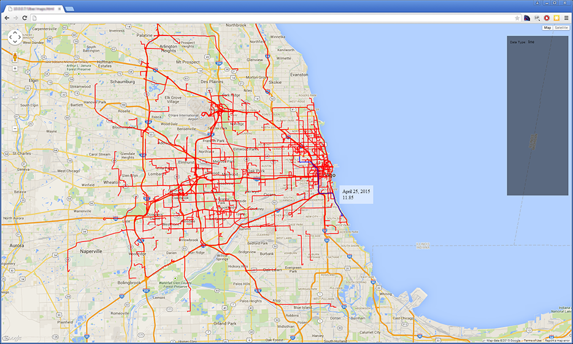
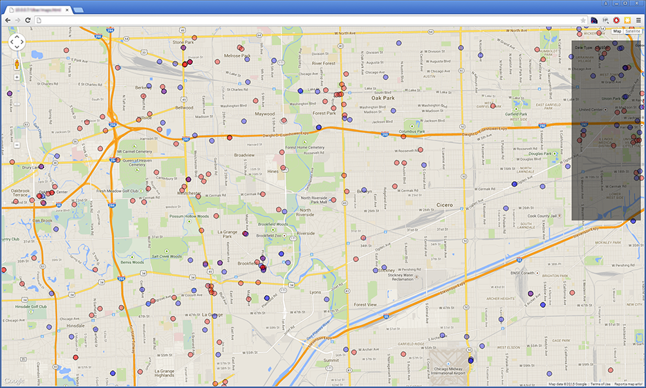
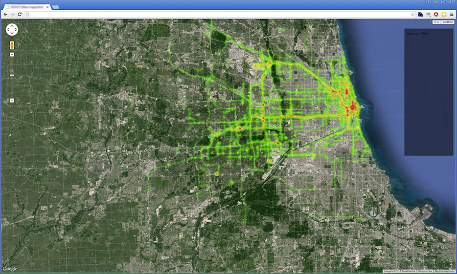
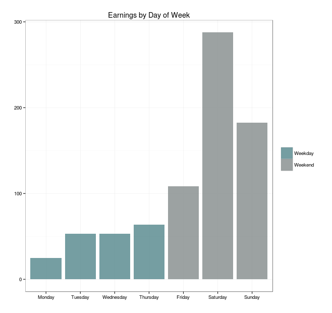
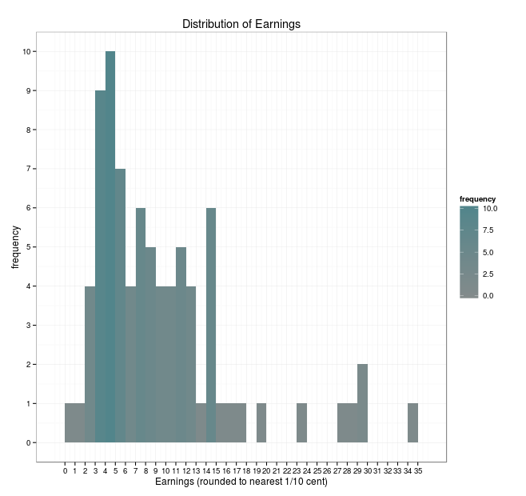
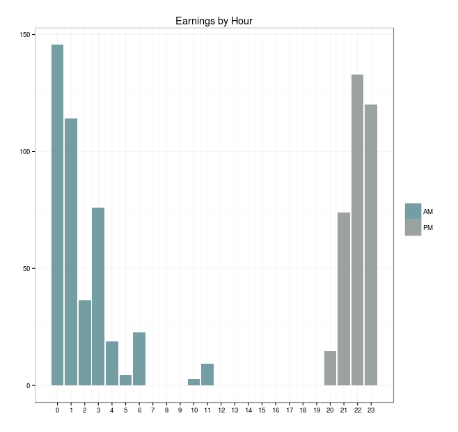
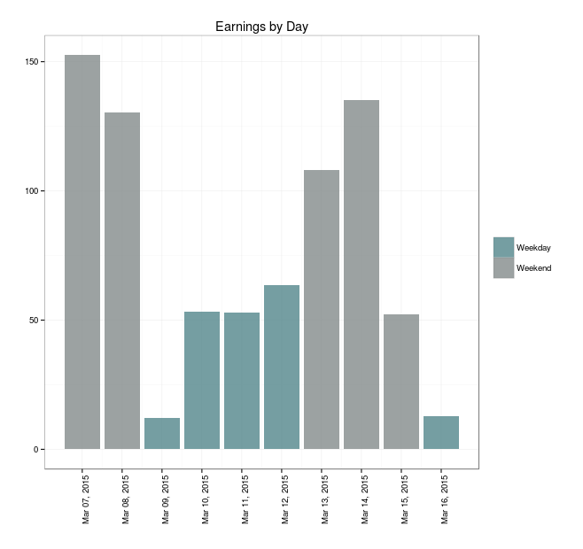

# Ooohbrr schtatt (a.k.a. schtatt)
Personal Data Visualization tools for the data genetated by partners from the Uber platform

While in between gigs I began driving for one of the popular cab-like services. The name "Ooohbrr" is a pun based off something that a customer said on the first day of driving. This project aims to visually represent the effort put into driving, maximize your earning potential and eliminate wasted time, effort and expense. 

This project stems from my desire to use some of the new skills I'm learning, namely Python, R, and JavaScript with a focus on data visualization. That being said, this initial release is a test to gauge interest. It is also my first time working with Python and "live" experience with R so be gentle. Feel free to reach out, clone, fork, contribute and make this project better. It is designed to work out of the box with a regular web server. If there is interest I will make it NodeJS compatible. 

There is lots of gnarly code and moving/missing/incomplete pieces here. I'm working on it. I will gladly listen to any recommendations. 

I'm still working on the R portion of this project as I've recently changed the DATA format to JSON. As it stands now the JSON formatting is a pain to deal with in R. 


##Requirements
* Python 2.7+
* Web server <sup>1</sup>
* R/R Studio (optional)

######\* Developers may need a Google Maps API Key######

##Why
We'll get to that in a bit. 

##How it works
Unlike the riders, the driving service provide no API for the diver stats and only exposes the detailed information you generate via their online reports (the CSV versions are terrible in comparison to the HTML versions). I wanted to test if the service claims were true. The claim that you can **make \$XX/hour** doesn't take into account gas, taxes, insurance, wear and tear or maintenance. This project aims to prove or disprove the claims by determine the actual $XX/hour when the "other" costs are taken into account and **maximize** your profits while reducing the level of effort <sup>2</sup>.

Using a python script, the code logs into your profile page and screen scrapes the information already provided by the service. The script organizes that data into a JSON (or CSV) file that you can use in your own projects or use with this one.

The R portion of this is optional but adds another level of detail that can help make sure you are making the best of it. 

The script currently builds the JSON object from scratch every time it runs, this means it is **NOT** intelligent enough to append new data yet. Like any good internet user, pounding the servers is **NOT** recommended. This project meant to be used periodically to round out the tools already provided by the service and organize the data into a format that makes sense. 


##Installation & Configuration

####<span style="color:orange;">WARNING: This is meant to run locally! DO NOT UPLOAD THIS TO AN UNSECURED/PUBLIC WEBDSERVER! PASSWORDS ARE NOT PROTECTED!</span>####

1. Clone or fork the repository to your local web server 
2. Edit config.json file
    + email: address used to login to your account
    + password: used to login to your account
    + home: coordinates for your home or work area. Google "coordinates for YOUR_HOME" (without quotes), enter the results here
    + <span style="color:orange;">This is meant to run locally! DO NOT UPLOAD THIS TO AN UNSECURED/PUBLIC WEBDSERVER! PASSWORDS ARE NOT PROTECTED AND COULD RESULT IN YOUR ACCOUNT BEING COMPROMISED!</span>
3. Via the command line navigate to the directory the project is located in
4. type ```python schtatt.py ``` at the prompt and hit enter
5. Wait until the script stops running
6. Open maps.html in the browser and look at your data
7. Instructions for the R code will come soon


### Mapping
Mapping portion of this project is designed to visually represent the data you are generating. The mapping currently comes in 3 flavors, the level of granularity will continue to evolve as I work on it. 


##### Line Map
Interactive map highlighting all routes taken. Mouseover a route and see the details associated with it


A few observations based on my experience

    + The GPS lady lies to me all the time
    + The GPS way may not always be the fastest way and in some cases is completely wrong (by way of miles)
    + Ask the rider if they have a preferred way of going home, this is a major cause of frustration for the riders
    + The Google Maps level of detail depends greatly upon the pin placement by the end user. This is the main reason you may see small squiggles at the end of a trip.


##### Cluster Analysis
Want to know where your most of your pickup and drop-offs happen? This map offers some insight as to where clusters of activity appear in your area. Want to know where most of your highest earnings are generated from, use this map to help determine that. 



##### Heat Map
This heat map is a visual representation of where you spend most of your time. Red means you spend a lot of time in that area. Whether or not that translates to higher earnings can only be determined by you and hopefully the R portion of this project.



##Visualization
This is still in the works, but here are some charts and statistical analysis highlighting the data. This is where you will get the breakdown of highest/lowest earnings, shortest/longest rides, level of effort etc. 

What is your most profitable day of the week?



How often to you earn a certain amount? Would you be surprised that there is a correlation between your larger # of smaller earnings, surge pricing and the clustering/heat mapping?



What are your earnings by Hour of the day?



What are your total earnings by Day?



---
##Change Log
**April 30, 2015**

Uploaded the project


1: Due to XHR security restrictions in browsers, running the project without the aid of a web server is not possible at this time. I'm currently looking at some proposed HTML 5 solutions which would allow for running the project locally without the need for a web server. Stay tuned

2: Level of effort is the "true earnings"" per ride. It takes into account the distance traveled, fare, "other costs" and the # of pings home to track the ride. Higher number of pings = greater effort. Sitting in traffic is not nearly as profitable as actually moving. 